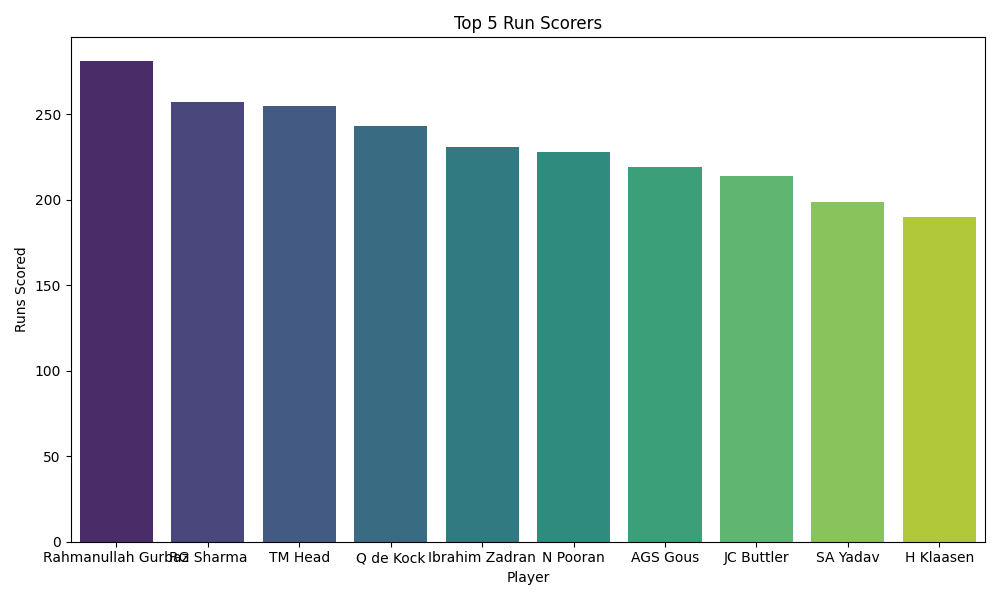
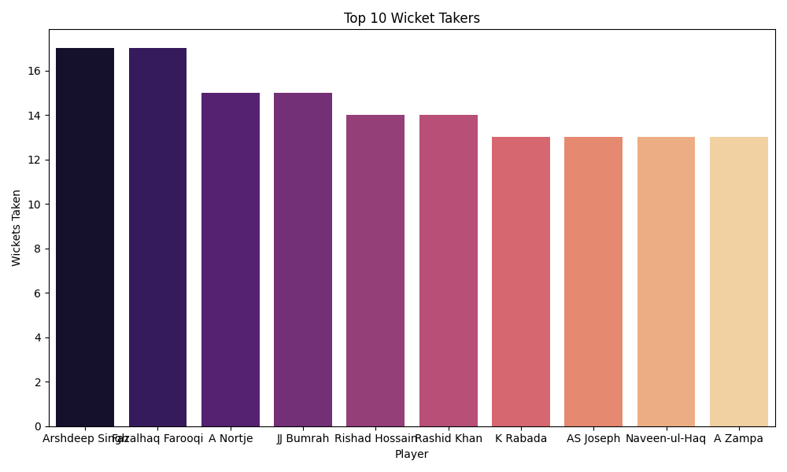
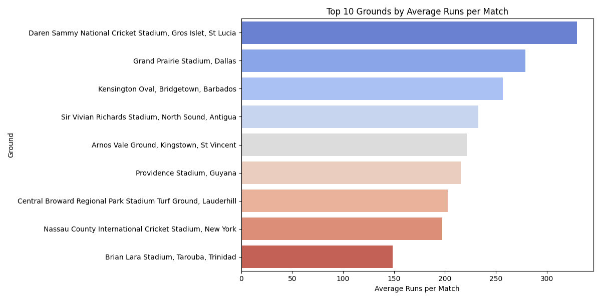
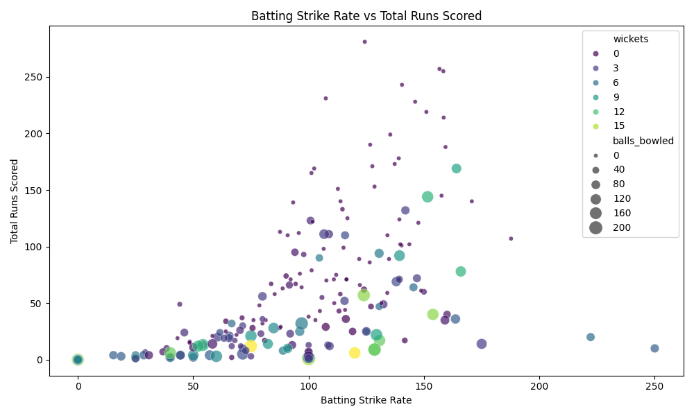
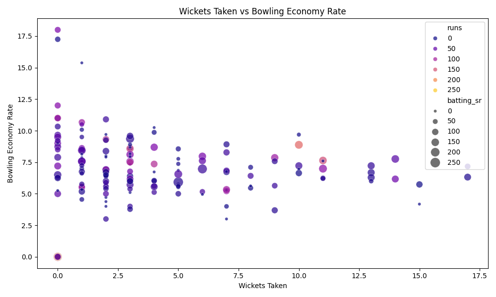
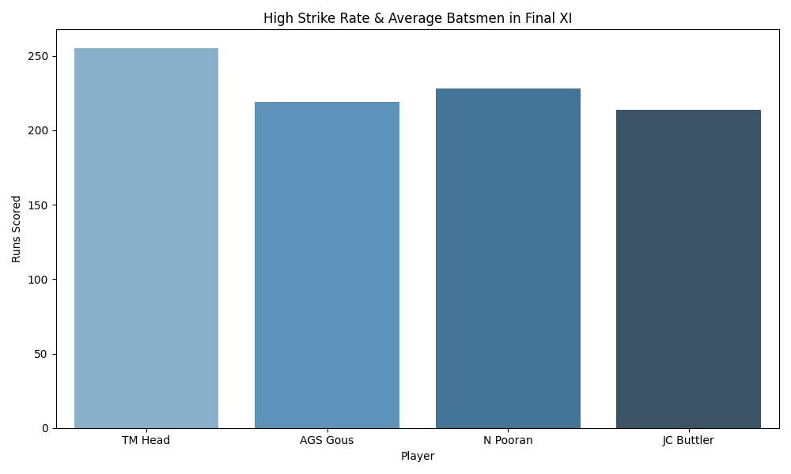

# 🏏 T20 World Cup 2024 Data Analysis

### 📄 Project Overview
This project analyzes the **T20 World Cup 2024** dataset (ball-by-ball data) to identify the best performing players and select an optimal "Team of the Tournament." 

Instead of relying solely on total runs or wickets, I used **Python** to engineer advanced metrics like Strike Rate, Economy Rate, and a custom **Weighted Performance Score** to find the most impactful players.

---

### 🏆 Key Findings: The Data-Driven Best XI
Based on a weighted scoring model (balancing Consistency vs. Aggression), here is the selected team:

| Role | Player | Key Stat |
| :--- | :--- | :--- |
| **Opener** | Travis Head (AUS) | SR: 158.4 |
| **Opener** | Rohit Sharma (IND) | Runs: 257 |
| **Wicketkeeper** | Rahmanullah Gurbaz (AFG) | Runs: 281 |
| **Middle Order** | Jos Buttler (ENG) | SR: 158.5 |
| **Middle Order** | Nicholas Pooran (WI) | SR: 146.2 |
| **Middle Order** | Andries Gous (USA) | Avg: 43.8 |
| **Spinner** | Rashid Khan (AFG) | Wkts: 14 |
| **Pacer** | Jasprit Bumrah (IND) | Econ: 4.18 |
| **Pacer** | Fazalhaq Farooqi (AFG) | Wkts: 17 |
| **Pacer** | Arshdeep Singh (IND) | Wkts: 17 |
| **Pacer** | Anrich Nortje (SA) | Wkts: 15 |

---

### 📊 Visual Analysis

#### 1. The Top Performers (General Stats)
First, I identified the leaders in raw volume—runs scored and wickets taken.

#### 2. Venue Analysis
Understanding pitch conditions is crucial. I analyzed the average runs scored at different grounds to understand where high-scoring games occurred.

#### 3. Advanced Metrics (Efficiency vs. Volume)
To select the Best XI, I looked beyond the totals. 
* **Batting:** I compared Strike Rate against Total Runs. Players in the top right are high-impact scorers.
* **Bowling:** I compared Economy Rate against Wickets. Players in the top left (like Bumrah) are elite.

#### 4. Final Selection Visualization
This chart highlights the final batters selected for the team based on their superior combination of Strike Rate and Average.

---

### 🧠 Methodology
The analysis followed this pipeline:

1.  **Data Cleaning:** Handling `NaN` values, filtering for legal deliveries (excluding wides/noballs from ball counts).
2.  **Feature Engineering:**
    * Calculated `Batting Average` and `Strike Rate`.
    * Calculated `Bowling Economy` and `Bowling Strike Rate`.
3.  **Weighted Scoring:**
    * Applied a formula: `Score = 0.5*Runs + 0.3*SR + 0.2*Avg` to rank players objectively.
4.  **Visualization:** Used Matplotlib/Seaborn to plot trends.

---

### 🛠️ Tech Stack
* **Language:** Python
* **File Format:** Jupyter Notebook (`.ipynb`)
* **Libraries:** Pandas, NumPy, Matplotlib, Seaborn

### 🚀 How to View
You can view the full analysis code and charts directly in this repository by clicking on the `code.ipynb` file.

---

### 👤 Author
* **Name:** Bagineni Venkata Sanjay Rayal
* **Role:** Aspiring Data Analyst
